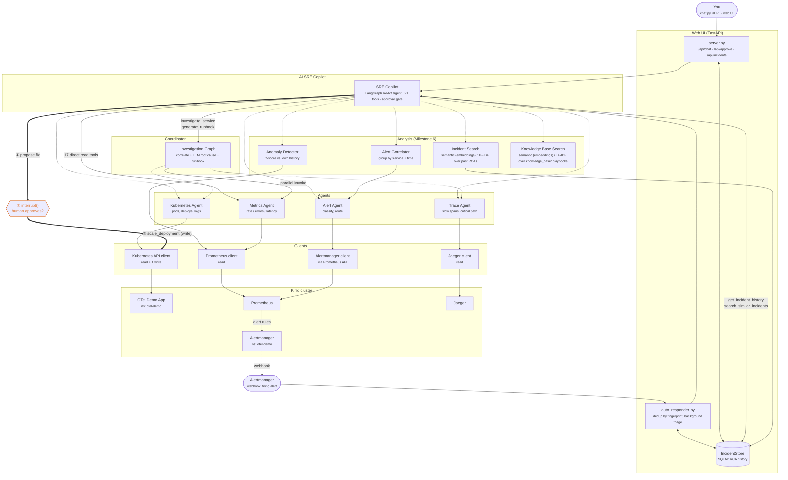

# Multi-Agent AI SRE Platform — Architecture

Layered view of the platform, from the two front ends down to the Kind
cluster. Solid arrows are read paths. The dashed orange path is the
platform's only cluster-mutating action, gated behind human approval.

There are two ways in. **Pull** — a human asks the copilot a question via the
CLI or the browser. **Push** — Alertmanager posts a firing alert to the
webhook and the copilot investigates it with nobody watching. Both converge
on the same `SRECopilot` instance, the same 21 tools, and the same approval
gate.

## Components

- **Clients** (`ai_platform/tools/*_client.py`, `alertmanager.py`): thin,
  mostly read-only wrappers around Prometheus, Jaeger, Kubernetes, and
  Alertmanager (currently backed by Prometheus's `/api/v1/alerts`; the demo
  chart's own Alertmanager subchart is now enabled in `otel-demo` and pushes
  firing alerts to the webhook, but this read client hasn't been repointed
  at it yet).
- **Agents** (`ai_platform/tools/*_agent.py`): domain logic over the
  clients — Metrics, Trace, Kubernetes, and Alert agents.
- **Analysis** (`ai_platform/tools/`): `alert_correlator.py` groups related
  alerts into incidents, `anomaly_detector.py` flags metrics behaving
  unusually for their own history, `incident_search.py` and
  `knowledge_base.py` both rank documents against a free-text query via
  `semantic_search.py` — real embeddings similarity (Voyage AI, via
  `embeddings_client.py`) when `VOYAGE_API_KEY` is set, TF-IDF
  keyword/phrase-overlap otherwise. `incident_search.py` searches this
  platform's own auto-generated past RCA text; `knowledge_base.py`
  searches human-authored playbooks under `knowledge_base/` at the repo
  root instead.
- **Service resolution** (`ai_platform/tools/service_matching.py`): maps an
  alert to the service it's about, by label first and token-matched alert
  name second. Shared by the coordinator and the correlator so the two can't
  drift apart.
- **PII/secret redaction** (`ai_platform/tools/pii_redaction.py`): a
  best-effort regex scrub (emails, SSNs, card-like numbers, phone numbers,
  API keys/bearer tokens) applied at two points before real cluster data —
  pod logs, Kubernetes events, RCA reports — reaches a third-party LLM API
  or gets persisted to `IncidentStore`'s SQLite file: at the source
  (`KubernetesClient.get_pod_logs`/`get_recent_events`) and again as a
  defense-in-depth backstop over every read tool's output
  (`copilot_tools._serialize`). Not a compliance-grade classifier — pattern
  based, so it can miss free-text PII and occasionally false-positive.
  Deliberately leaves IPs/hostnames alone since those are core SRE signal.
- **Investigation Graph** (`ai_platform/coordinator/`): a LangGraph
  coordinator that gathers metrics/traces/Kubernetes evidence in parallel,
  correlates it, and has an LLM produce a structured root-cause report
  (`rca.py`) and, on request, a separate execution-ready runbook
  (`runbook.py`). `generate_runbook` always re-runs the full investigation
  by default (a stale runbook is worse than a slightly slower one), but the
  copilot tool layer (`copilot_tools.py`'s `_investigation_cache`) skips
  that re-investigation — reusing the `RCAFinding` `investigate_service`
  already produced via the graph's `generate_runbook_from_finding` — when
  one exists for the same conversation and service, is under 2 minutes old,
  and no evidence-gathering tool has touched that service since.
- **SRE Copilot** (`ai_platform/copilot/`): a conversational LangGraph ReAct
  agent over all of the above. Includes one cluster-mutating tool,
  `remediate_scale_deployment`, gated by a real approval pause
  (`interrupt()` / `Command(resume=...)`) — the write path is unreachable
  until a human approves. A `pre_model_hook` (`_build_trim_history_hook`)
  caps conversation history sent to the LLM each turn to a per-model token
  budget (`_max_history_tokens_for`), so token cost per turn stays roughly
  flat instead of growing with conversation length — the full history still
  persists in the checkpointer for the UI's tool-call trace, only what the
  model sees is trimmed. Runs on a deliberately *different, cheaper* model
  than `InvestigationGraph`'s RCA/runbook calls (see `DEFAULT_CHEAP_MODELS`
  in `agent.py`): tool-routing is the highest-volume LLM call site in the
  platform and a task smaller models handle well (validated against
  `llama-3.1-8b-instant` via `ai_platform/evals/run_tool_use_evals.py`,
  including the one safety-relevant anti-pattern case — the guardrail in
  `copilot_tools.py` caught it regardless of model), whereas RCA/runbook
  reasoning stays on the stronger `LLM_PROVIDER`/`LLM_MODEL` tier.
- **Web UI** (`ai_platform/webui/`): FastAPI backend wrapping the same
  copilot instance the CLI uses, plus `auto_responder.py`, which turns the
  platform from pull-based to push-based by investigating Alertmanager
  webhooks automatically. `IncidentStore` (`tools/incident_store.py`)
  persists every incident and its RCA to SQLite, which is also what makes
  the copilot's own history tools answerable. Three tabs share that one
  data source: Chat (conversational, tool-call trace, approval modal),
  Timeline (every incident, chronological), and Operations Hub — the
  default landing tab — a KPI view (`GET /api/operations-hub`): incident
  count, resolution rate, median time to mitigate, pending approvals, a
  daily volume/outcomes chart, and a recent-incidents list, all
  server-side aggregation of the same `IncidentStore` rows, no new data
  source. There's no longer a persistent sidebar — Timeline and Operations
  Hub made a standing Alerts/Incidents list redundant, so it was removed.

## Tool inventory

The copilot exposes 21 tools: 18 that read live state or history directly
(including `search_similar_incidents` and `search_knowledge_base`), 2 that
run the full LLM investigation pipeline (`investigate_service`,
`generate_runbook`), and 1 that writes (`remediate_scale_deployment`).

## Notes

- Every layer below the Copilot is strictly read-only. The only mutation
  anywhere in the platform is `KubernetesClient.scale_deployment`, reachable
  solely through the approved remediation path.
- Every string that could carry customer/cluster data out to the LLM or into
  `IncidentStore` passes through `pii_redaction.py` twice — once at the
  client that first pulled it off the cluster, once again as a backstop when
  the copilot serializes a tool's result — so a single missed call site
  doesn't mean unredacted data ships.
- Auto-triage automates *notice + investigate*, never *change the cluster* —
  an auto-triaged incident that proposes a fix still parks on
  `awaiting_approval` until a human decides.
- `Copilot -- investigate_service --> Graph` and `Copilot -- direct tools -->
  Agents` both terminate in the same four agents, which is why the copilot
  can answer either a quick fact ("which service has the highest CPU?") or a
  full root-cause question ("why is checkout slow?") depending on how it's
  asked.
- See `ai_platform/copilot/REMEDIATION_RUNBOOK.md` for a live, step-by-step
  walkthrough of the human-approved write path end to end.

## Known gaps

The approval gate is enforced in-process. `server.py` now defaults to
binding `127.0.0.1` (override with `WEBUI_HOST`) and requires real
per-user authentication for every human-facing route: signing in with
Google OIDC (`/auth/login` → Google → `/auth/callback`) sets a signed,
httponly session cookie (`SESSION_SECRET_KEY`, `WEBUI_COOKIE_SECURE`), and
`request.session["user"]["email"]` is checked on every `/api/*` route.
Optional `ALLOWED_GOOGLE_EMAILS`/`ALLOWED_GOOGLE_DOMAIN` allowlists add
authorization on top of that authentication — without them, any Google
account can sign in. This replaces the previous shared-secret
`WEBUI_API_KEY` model for humans, closing the gap this section used to
flag ("a single static key with no rotation or per-user scoping is still a
shared-secret model, not proper auth").

`WEBUI_API_KEY` still exists, but scoped down to exactly one caller:
Alertmanager's webhook POST (`/api/webhook/alertmanager`, via a Bearer
token — see `observability/helm/otel-demo-minimal-values.yaml`), which can't
complete an OAuth browser redirect since it isn't a browser. If it isn't
set, one is auto-generated and printed at startup (Jupyter-token style)
for that one route, same as before.

PII/secret redaction (`pii_redaction.py`) is pattern-based, not a compliance
classifier: it will miss anything that doesn't match its regexes (e.g. a
name in free text, non-US phone/SSN formats) and can occasionally
false-positive on something shaped like — but not actually — an email,
card number, or secret. Treat it as a floor, not a guarantee, for what
reaches the LLM API or `IncidentStore`.

Remaining gaps: OAuth client secrets and the session-signing key still live
in `.env` in plaintext (same tradeoff already accepted for the LLM API key
— out of scope for a local-dev tool, see `env_hygiene.py`); token refresh
isn't implemented (a session simply expires after 8 hours and the user
signs in again, rather than silently refreshing); and there's no
per-role authorization within a signed-in session — every allowlisted user
currently has identical access, including the ability to approve
remediations. A real deployment wanting to distinguish "can view" from
"can approve a cluster mutation" would need a role claim on top of this.

Two more are now addressed:
- `reason` is still LLM-authored free text (that part can't be fully solved
  without deeper semantic grounding), but `remediate_scale_deployment` now
  structurally requires that some evidence-gathering tool
  (`investigate_service`, `get_deployment_health`, etc.) was actually called
  earlier in the conversation for that service — a purely speculative first
  call is blocked before a human ever sees it, regardless of how convincing
  `reason` reads.
- `.env` still holds the LLM API key in plaintext (no vault/rotation —
  out of scope for a local-dev tool), but `chat.py` and `server.py` now warn
  at startup if the file is group/world-readable
  (`ai_platform/tools/env_hygiene.py`), the same way they already warn about
  a missing API key.
