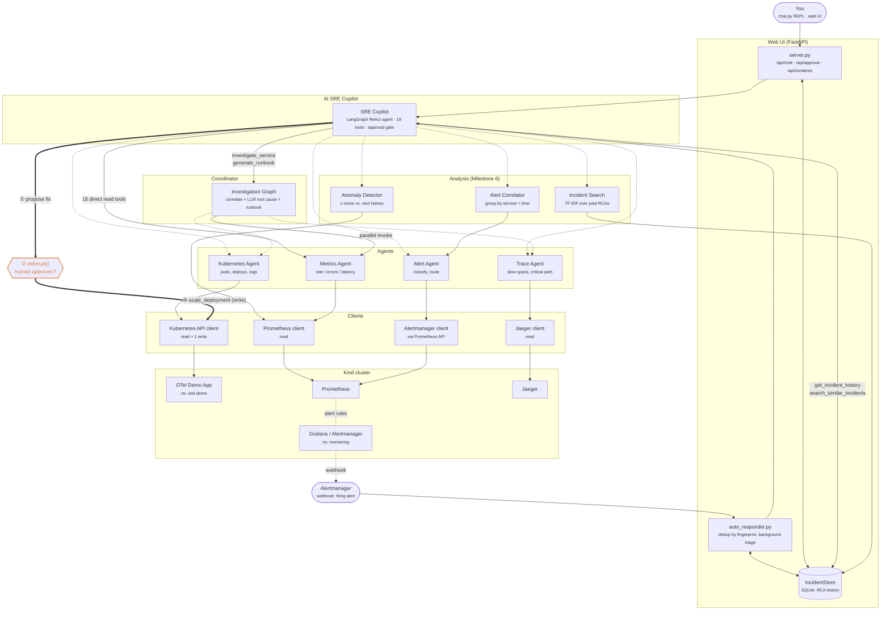

# Multi-Agent AI SRE Platform — Architecture

Layered view of the platform, from the two front ends down to the Kind
cluster. Solid arrows are read paths. The dashed orange path is the
platform's only cluster-mutating action, gated behind human approval.

There are two ways in. **Pull** — a human asks the copilot a question via the
CLI or the browser. **Push** — Alertmanager posts a firing alert to the
webhook and the copilot investigates it with nobody watching. Both converge
on the same `SRECopilot` instance, the same 19 tools, and the same approval
gate.

## Components

- **Clients** (`ai-platform/tools/*_client.py`, `alertmanager.py`): thin,
  mostly read-only wrappers around Prometheus, Jaeger, Kubernetes, and
  Alertmanager (backed by Prometheus's `/api/v1/alerts`, since the demo chart
  doesn't ship Alertmanager).
- **Agents** (`ai-platform/tools/*_agent.py`): domain logic over the
  clients — Metrics, Trace, Kubernetes, and Alert agents.
- **Analysis** (`ai-platform/tools/`): `alert_correlator.py` groups related
  alerts into incidents, `anomaly_detector.py` flags metrics behaving
  unusually for their own history, `incident_search.py` does TF-IDF lookup
  over past RCA text.
- **Service resolution** (`ai-platform/tools/service_matching.py`): maps an
  alert to the service it's about, by label first and token-matched alert
  name second. Shared by the coordinator and the correlator so the two can't
  drift apart.
- **Investigation Graph** (`ai-platform/coordinator/`): a LangGraph
  coordinator that gathers metrics/traces/Kubernetes evidence in parallel,
  correlates it, and has an LLM produce a structured root-cause report
  (`rca.py`) and, on request, a separate execution-ready runbook
  (`runbook.py`).
- **SRE Copilot** (`ai-platform/copilot/`): a conversational LangGraph ReAct
  agent over all of the above. Includes one cluster-mutating tool,
  `remediate_scale_deployment`, gated by a real approval pause
  (`interrupt()` / `Command(resume=...)`) — the write path is unreachable
  until a human approves.
- **Web UI** (`ai-platform/webui/`): FastAPI backend wrapping the same
  copilot instance the CLI uses, plus `auto_responder.py`, which turns the
  platform from pull-based to push-based by investigating Alertmanager
  webhooks automatically. `IncidentStore` (`tools/incident_store.py`)
  persists every incident and its RCA to SQLite, which is also what makes
  the copilot's own history tools answerable.

## Tool inventory

The copilot exposes 19 tools: 16 that read live state or history directly,
2 that run the full LLM investigation pipeline (`investigate_service`,
`generate_runbook`), and 1 that writes (`remediate_scale_deployment`).

## Notes

- Every layer below the Copilot is strictly read-only. The only mutation
  anywhere in the platform is `KubernetesClient.scale_deployment`, reachable
  solely through the approved remediation path.
- Auto-triage automates *notice + investigate*, never *change the cluster* —
  an auto-triaged incident that proposes a fix still parks on
  `awaiting_approval` until a human decides.
- `Copilot -- investigate_service --> Graph` and `Copilot -- direct tools -->
  Agents` both terminate in the same four agents, which is why the copilot
  can answer either a quick fact ("which service has the highest CPU?") or a
  full root-cause question ("why is checkout slow?") depending on how it's
  asked.
- See `ai-platform/copilot/REMEDIATION_RUNBOOK.md` for a live, step-by-step
  walkthrough of the human-approved write path end to end.

## Known gaps

The approval gate is enforced in-process. The HTTP layer in front of it
(`server.py`) has no authentication and binds `0.0.0.0`, so on an untrusted
network the gate is reachable by anyone who can reach the port. Treat this
as a local-development platform until that's addressed.
