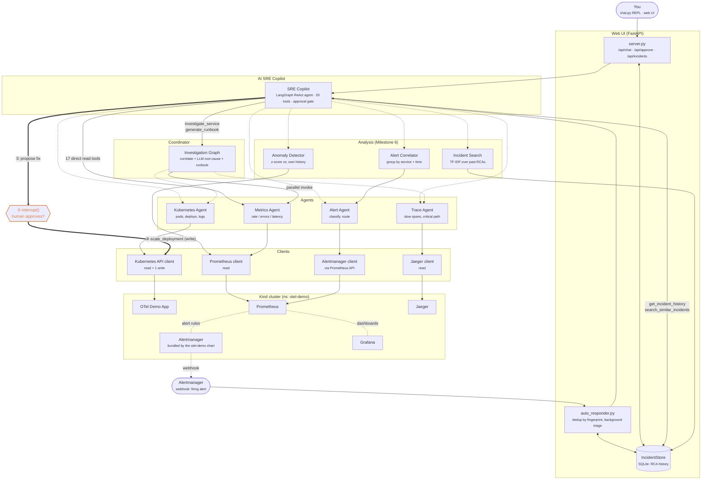

# Multi-Agent AI SRE Platform

A production-style multi-agent platform that performs automated incident
investigation and root cause analysis over a live Kubernetes workload.

Alerts fire → the platform investigates them autonomously → it produces a
grounded RCA and an execution-ready remediation runbook → a human approves
any change that touches the cluster.

**Demo video:** [add link here]

**Stack:** OpenTelemetry Demo (Astronomy Shop) · Kubernetes (Kind) ·
Prometheus / Alertmanager / Grafana · Jaeger + OpenTelemetry Collector ·
Python 3.14, LangGraph, FastAPI

---

## Functional Requirements

- **Autonomous detection** — Alertmanager webhook triggers investigation automatically, no polling.
- **Parallel multi-agent investigation** — Metrics, Trace, and Kubernetes agents gather evidence at once, with every tool call visible.
- **Grounded root-cause reports** — RCA is tied to the actual metrics/traces pulled for that incident.
- **Execution-ready runbooks** — a second LLM pass turns the RCA into concrete remediation steps.
- **Human-gated remediation** — the one cluster-mutating action pauses on a real approval gate.
- **Incident memory** — search past incidents to answer "has this happened before?"
- **Alert correlation** — related alerts group into one incident instead of many.
- **Anomaly detection** — z-score checks flag metrics behaving unusually vs. their own history.
- **Knowledge base search** — search over human-authored runbooks/playbooks, not just past incidents.
- **Operations Hub** — KPI dashboard: resolution rate, time-to-mitigate, pending approvals.
- **Google sign-in + PII redaction** — per-user auth, plus a regex scrub before data reaches the LLM.
- **CLI copilot** — same agent, same tools, from a terminal instead of the browser.

---

## Non-Functional Requirements

- **Safety** — the only write action is gated by a real execution pause (`interrupt()`), structurally unreachable until approved.
- **Security** — Google OIDC for humans, shared bearer token for the Alertmanager webhook; PII redacted before it reaches the LLM or storage.
- **Transparency** — every tool call an agent makes is recorded and shown, not hidden in an opaque completion.
- **Reliability** — every layer below the copilot is read-only, bounding a bad LLM decision to a suggestion, never a cluster change.
- **Performance** — metrics/trace/Kubernetes evidence is gathered in parallel per investigation, not sequentially.
- **Testability** — full test suite runs against mocks, no live cluster/API key/network required.
- **Maintainability** — alert-to-service resolution is centralized in one shared module, not duplicated.
- **Accepted trade-offs** — no per-role authorization yet; PII redaction is pattern-based, not compliance-grade; OAuth secret/session key live in plaintext `.env`; no token refresh (sessions expire after 8h).

---

## Architecture

Layered view of the platform, from the two front ends down to the Kind
cluster. Solid arrows are read paths. The dashed orange path is the
platform's only cluster-mutating action, gated behind human approval.

There are two ways in. **Pull** — a human asks the copilot a question via the
CLI or the browser. **Push** — Alertmanager posts a firing alert to the
webhook and the copilot investigates it with nobody watching. Both converge
on the same `SRECopilot` instance, the same 20 tools, and the same approval
gate.



### Components

- **Clients** (`ai_platform/tools/*_client.py`, `alertmanager.py`): thin,
  mostly read-only wrappers around Prometheus, Jaeger, Kubernetes, and
  Alertmanager (backed by Prometheus's `/api/v1/alerts`, since the demo chart
  doesn't ship Alertmanager).
- **Agents** (`ai_platform/tools/*_agent.py`): domain logic over the
  clients — Metrics, Trace, Kubernetes, and Alert agents.
- **Analysis** (`ai_platform/tools/`): `alert_correlator.py` groups related
  alerts into incidents, `anomaly_detector.py` flags metrics behaving
  unusually for their own history, `incident_search.py` does TF-IDF lookup
  over past RCA text.
- **Service resolution** (`ai_platform/tools/service_matching.py`): maps an
  alert to the service it's about, by label first and token-matched alert
  name second. Shared by the coordinator and the correlator so the two can't
  drift apart.
- **Investigation Graph** (`ai_platform/coordinator/`): a LangGraph
  coordinator that gathers metrics/traces/Kubernetes evidence in parallel,
  correlates it, and has an LLM produce a structured root-cause report
  (`rca.py`) and, on request, a separate execution-ready runbook
  (`runbook.py`).
- **SRE Copilot** (`ai_platform/copilot/`): a conversational LangGraph ReAct
  agent over all of the above. Includes one cluster-mutating tool,
  `remediate_scale_deployment`, gated by a real approval pause
  (`interrupt()` / `Command(resume=...)`) — the write path is unreachable
  until a human approves.
- **Web UI** (`ai_platform/webui/`): FastAPI backend wrapping the same
  copilot instance the CLI uses, plus `auto_responder.py`, which turns the
  platform from pull-based to push-based by investigating Alertmanager
  webhooks automatically. `IncidentStore` (`tools/incident_store.py`)
  persists every incident and its RCA to SQLite, which is also what makes
  the copilot's own history tools answerable.

### Tool inventory

The copilot exposes 20 tools: 17 that read live state or history directly
(including `detect_service_anomalies`, the Milestone 6 z-score anomaly
detector), 2 that run the full LLM investigation pipeline
(`investigate_service`, `generate_runbook`), and 1 that writes
(`remediate_scale_deployment`).

### Notes

- Every layer below the Copilot is strictly read-only. The only mutation
  anywhere in the platform is `KubernetesClient.scale_deployment`, reachable
  solely through the approved remediation path.
- Auto-triage automates *notice + investigate*, never *change the cluster* —
  an auto-triaged incident that proposes a fix still parks on
  `awaiting_approval` until a human decides.
- `Copilot -- investigate_service --> Graph` and `Copilot -- direct tools -->
  Agents` both terminate in the same four agents, which is why the copilot
  can answer either a quick fact ("which service has the highest CPU?") or a
  full root-cause question ("why is checkout slow?") depending on how it's
  asked.
- See [`docs/remediation-runbook.md`](docs/remediation-runbook.md) for a
  live, step-by-step walkthrough of the human-approved write path end to end.

### Project structure

```text
multi-agent-sre/
│
├── ai_platform/
│   ├── tools/          # observability clients + agents,
│   │                   #   plus analysis: alert_correlator,
│   │                   #   anomaly_detector, incident_search, incident_store
│   ├── coordinator/    # LangGraph investigation graph, RCA, runbooks
│   ├── copilot/        # conversational ReAct agent + CLI
│   ├── webui/          # FastAPI server, auto-triage, browser UI
│   ├── evals/          # LLM-quality evals (RCA, runbooks, tool-use) — real
│   │                   #   API calls against fixed scenarios, not pytest
│   └── runbooks/       # generated remediation docs (gitignored)
│
├── knowledge_base/     # human-authored runbooks (searchable by the copilot)
├── k8s/                 # Kubernetes manifests for deploying the web UI itself
├── observability/
│   └── helm/           # Helm values for the otel-demo chart install
│
├── Dockerfile
└── docs/                # additional documentation (see bottom of this file)
```

Each of the four `ai_platform/` unit-tested packages (`tools`, `coordinator`,
`copilot`, `webui`) has its own `tests/` subdirectory of mocked pytest
suites. `evals/` is deliberately separate — see
[`ai_platform/evals/README.md`](ai_platform/evals/README.md).

---

## Key Design Decisions

- **Real interrupt, not a prompt convention** — `remediate_scale_deployment` is gated with LangGraph's `interrupt()`/`Command(resume=...)`; the write path is structurally unreachable until a human calls `respond_to_approval()`, not just discouraged by a system prompt.
- **Strict read/write separation** — every layer below the copilot is read-only; the single write path only exists behind the approval gate, so a bad LLM decision can propose, never execute.
- **Two auth models, one per caller** — Google OIDC for humans (real per-user identity); a shared bearer token (`WEBUI_API_KEY`) for Alertmanager's webhook, since it can't complete an OAuth redirect.
- **TF-IDF over learned embeddings** — neither LLM provider (Anthropic, Groq) exposes an embeddings API, and a local embedding model would add a heavy `torch` dependency; TF-IDF keyword-overlap is a deliberate tradeoff, not an oversight.
- **SQLite, rebuilt index per query** — `IncidentStore` persists to a local SQLite file (no extra service dependency); `search_similar_incidents` rebuilds its TF-IDF index fresh each call, simple and correct at this incident volume.
- **Shared service-matching module** — alert-to-service resolution lives in one module used by both the coordinator and the correlator, after a prior split caused real misattribution bugs.
- **Push and pull converge on one copilot** — interactive (CLI/web) and auto-triaged (Alertmanager webhook) paths both route through the same `SRECopilot` instance and approval gate, so there's no second path to keep in sync.
- **Mocked test suite** — all 180 tests run against mocks/temp SQLite, with live-cluster smoke scripts excluded from `pytest` collection, so `uv run pytest` needs no cluster, API key, or network.

---

## Known Limitations

- **Authentication without authorization by default** — any verified Google account can sign in and reach the approval gate unless `ALLOWED_GOOGLE_EMAILS`/`ALLOWED_GOOGLE_DOMAIN` is set.
- **Keyword, not semantic, incident search** — TF-IDF won't catch a paraphrase with zero shared vocabulary.
- **One coarse write action** — only `remediate_scale_deployment` (scale to N replicas); no rollback tool, no other mutation types, no dry-run/diff preview.
- **In-memory auto-triage dedup** — `auto_responder.py`'s fingerprint dedup lives in the running process; a restart or multi-instance deployment can lose it and duplicate investigations.
- **Single-cluster, single-tenant** — one Kind cluster, one Alertmanager source, no multi-cluster routing, no tenant isolation, no RBAC beyond the service account's cluster permissions.
- **Not yet implemented** — Slack/Teams notifications, MCP server support, a dedicated visual incident timeline, deeper knowledge-base auto-integration, true embedding-based search, per-role authorization.

---

## Setup

Full prerequisites, install steps, running the platform, tests, fault
injection, and teardown are in [`docs/setup.md`](docs/setup.md).

Quickstart:

```bash
kind create cluster --name ai-sre
helm install otel-demo open-telemetry/opentelemetry-demo \
  --namespace otel-demo --create-namespace \
  --values observability/helm/otel-demo-minimal-values.yaml
uv sync && cp .env.example .env   # then fill in your API key
uv run python ai_platform/webui/server.py   # open http://localhost:8000
```

---

## Additional Documentation

| Doc | Covers |
| --- | --- |
| [`docs/setup.md`](docs/setup.md) | Full setup, running the platform, tests, teardown |
| [`docs/remediation-runbook.md`](docs/remediation-runbook.md) | Live, end-to-end fault-injection → approval → repair walkthrough |
| [`docs/setup-openetemetry-demo.md`](docs/setup-openetemetry-demo.md) | Notes on the OTel demo Helm chart on a local Kind node |
